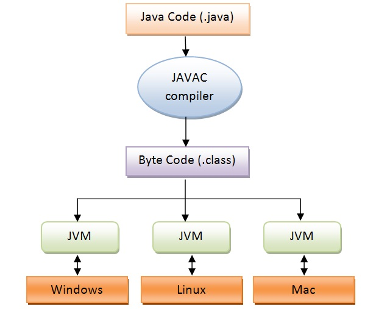
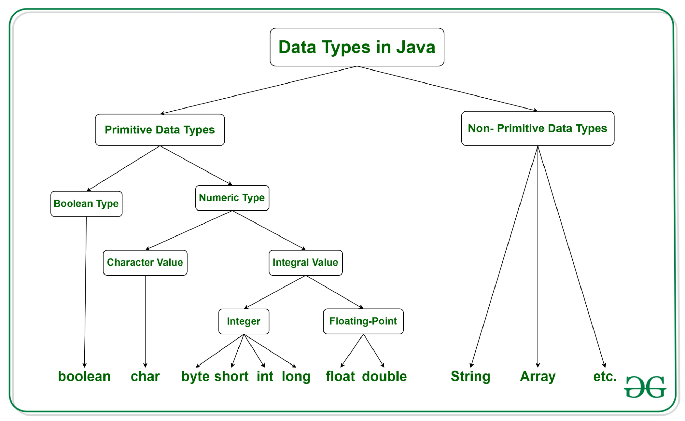
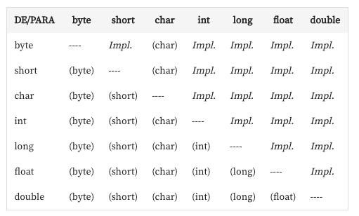
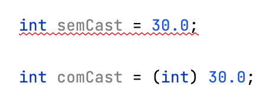
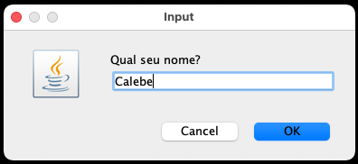
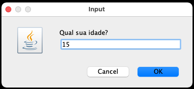
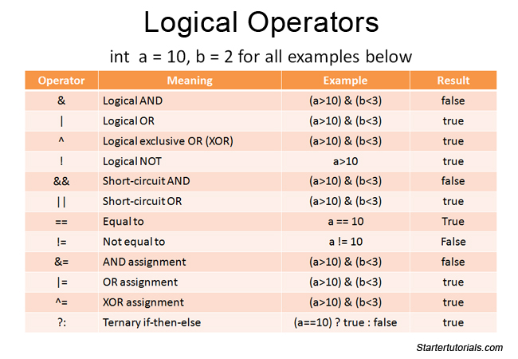

<html><head><meta content="text/html; charset=UTF-8" http-equiv="content-type"></head><body class="c18 c21 doc-content">
INTRODU&Ccedil;&Atilde;O

Linguagem com alta compatibilidade para mobile, web, desktop, etc. Criado pela Sun Microsystems, idealizado por James Goslings, mas desenvolvido por uma equipe desta empresa.

A JVM (Java Virtual Machine) traduz o c&oacute;digo .java para seu elemento em mais baixo n&iacute;vel, sendo ela uma TV, smartphone, PC, microondas, etc.

Desta forma, n&atilde;o se fez mais necess&aacute;rio escrever 1 c&oacute;digo para cada plataforma, um &uacute;nico c&oacute;digo escrito em java, &eacute; traduzido pela JVM para N plataformas.

SA&Iacute;DA DE DADOS

public class Program {

&nbsp; &nbsp;public static &nbsp;void Main(String[] args)

&nbsp; &nbsp;{

&nbsp; &nbsp; &nbsp; &nbsp;System.out.println(&quot;Hello World!&quot;);

&nbsp; &nbsp;}

}

DECLARA&Ccedil;&Atilde;O DE VARI&Aacute;VEIS

double salario = 1.2D; //Num&eacute;ros maiores

float flutuante = 1.5F; //N&uacute;meros menores para mem&oacute;rias restringidas

int idade = 25;

long numeroGrande = 1000000000; //Maior capacidade de storage

short valorPequeno = 1000;

byte b = 127;

boolean boleana = false;

CASTING

Cast Impl&iacute;cito &eacute; quando armazenamos um INTEGER num DOUBLE ou FLOAT.

Como por padr&atilde;o ambas podem receber valores inteiros, n&atilde;o se faz a necessidade de explicitamente fazer tal convers&atilde;o. O QUE N&Atilde;O ACONTECE AO CONTR&Aacute;RIO

Tabela de CASTINGs, caso haja (variavel), significa que temos um cast expl&iacute;cito.

ENTRADA DE DADOS

//Instancia a classe SCANNER para leitura dos INPUTS

Scanner scanner = new Scanner(System.in);

System.out.println(&quot;Vamos ler um string: &quot;);

String string = scanner.nextLine();

System.out.println(&quot;Vamos ler um inteiro: &quot;);

int inteiro = scanner.nextInt();

System.out.println(&quot;Vamos ler um boolean&quot;);

boolean bool = scanner.nextBoolean();

scanner.nextLine();

/*

Limpa o SCANNER, pois o m&eacute;todo acima leu

apenas o booleano, e ao pressionar ENTER, o \n

espa&ccedil;o permanece no SCANNER!

*/

System.out.println(&quot;Vamos ler um string novamente&quot;);

String string2 = scanner.nextLine();

JOPTIONPANE

&Eacute; uma biblioteca de GUI (Graphical User Interface) para Java.

//IMPORTA A BIBLIOTECA NECESS&Aacute;RIA.

import javax.swing.JOptionPane;

public class Main {

&nbsp; &nbsp;public static void main(String[] args)

&nbsp; &nbsp;{

&nbsp; &nbsp; &nbsp; &nbsp;String nome = JOptionPane.showInputDialog(&quot;Qual seu nome?&quot;);

&nbsp; &nbsp; &nbsp; &nbsp;//Como retorna um STRING, faz-se necess&aacute;rio

&nbsp; dar um PARSE para convert&ecirc;-lo.

&nbsp; &nbsp; &nbsp; &nbsp;int idade = Integer.parseInt(JOptionPane.showInputDialog(&quot;Qual sua idade?&quot;));

&nbsp; &nbsp; &nbsp; &nbsp;JOptionPane.showMessageDialog(null,&quot;Ol&aacute; &quot;+nome+&quot; de &quot;+idade+&quot; anos.&quot;);

&nbsp; &nbsp;}

}

MATH

Uma biblioteca para facilitar opera&ccedil;&otilde;es matem&aacute;ticas.

double x = 3.14;

double y = -10;

double z = 25;

//Mostra o maior entre X e Y, no caso = 3.14

Math.max(x,y);

//Mostrar&aacute; o absoluto de Y, no caso = +10

Math.abs(y);

//Mostrar&aacute; SQUARE ROOT, raiz quadrada de Z = 5.0;

Math.sqrt(z);

//Arredondar&aacute; para BAIXO, neste caso X = 3.0;

Math.round(x);

//Arredondar&aacute; para CIMA, neste caso X = 4.0;

Math.ceil(x);

//Mostrar&aacute; a HIPOTENUSA entre X e Y

Math.hypot(x,y);

RANDOM

Gera um valor aleat&oacute;rio! Podendo ser inteiro, double, e at&eacute; booleano.

import java.util.Random;

public class Main {

&nbsp; &nbsp;public static void main(String[] args)

&nbsp; &nbsp;{

&nbsp; &nbsp; &nbsp; &nbsp;Random random = new Random();

&nbsp; &nbsp; &nbsp; &nbsp;//Gera um INTEIRO de ZERO &agrave; SEIS

&nbsp; &nbsp; &nbsp; &nbsp;int inteiroAleatorio = random.nextInt(6);

&nbsp; &nbsp; &nbsp; &nbsp;//Gera um REAL de ZERO &agrave; UM

&nbsp; &nbsp; &nbsp; &nbsp;double doubleAleatorio = random.nextDouble(1);

&nbsp; &nbsp; &nbsp; &nbsp;//Retorna um TRUE ou FALSE

&nbsp; &nbsp; &nbsp; &nbsp;boolean boolAleatorio = random.nextBoolean();

&nbsp; &nbsp;}

}

DESVIO DE FLUXO

Estrutura de sele&ccedil;&atilde;o &eacute; uma estrutura de desvio do fluxo de controle presente em linguagens de programa&ccedil;&atilde;o que realiza diferentes a&ccedil;&otilde;es/computa&ccedil;&otilde;es dependendo se a condi&ccedil;&atilde;o/sele&ccedil;&atilde;o &eacute; verdadeira ou falsa, em que a express&atilde;o &eacute; processada e transformada em um valor booleano

int idade = 18;

//IF - ELSE

if (idade &gt;= 18)

&nbsp; &nbsp;System.out.println(&quot;Maior de Idade&quot;);

else if (idade &lt; 18 &amp; idade &gt;= 0)

&nbsp; &nbsp;System.out.println(&quot;Menor de Idade&quot;);

//SWITCH CASE

switch (idade)

{

&nbsp; &nbsp;case 0:

&nbsp; &nbsp; &nbsp; &nbsp;System.out.println(&quot;Rec&eacute;m-nascido&quot;);

&nbsp; &nbsp; &nbsp; &nbsp;break;

}

//OPERADOR TERN&Aacute;RIO

//variavel = (condicao) ? valor_se_verdadeiro : valor_se_falso;

String operadorTernario = (idade &gt;= 70) ? &quot;Idoso&quot; : &quot;Jovial&quot;;

System.out.println(operadorTernario);

ESTRUTURAS DE REPETI&Ccedil;&Atilde;O

&nbsp;
</body></html>